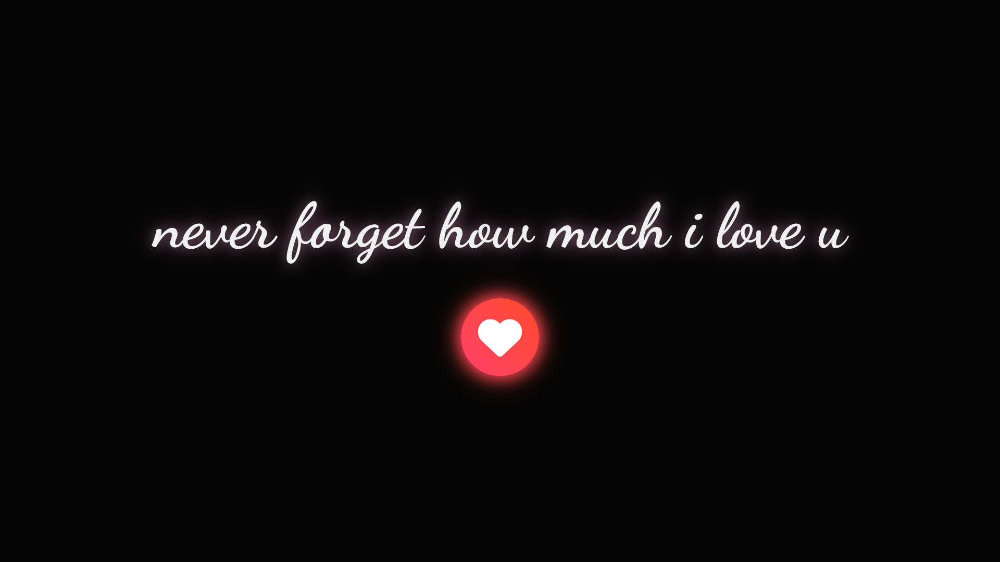

# Galeria Especial

> Uma carta de amor digital para alguém especial, revelando uma galeria de memórias com o clique de um coração.

## Imagem

## Sobre o Projeto

Este projeto é uma página web interativa, criada como uma surpresa romântica. A ideia é apresentar uma mensagem especial em uma página inicial e, com um simples clique em um botão, revelar uma galeria de fotos e memórias ao som de uma música de fundo.

É uma forma moderna e criativa de criar um presente digital, combinando uma declaração com momentos inesquecíveis.

---

## Funcionalidades

-   **Página de Abertura:** Uma landing page minimalista com uma mensagem de destaque.
-   **Botão Interativo:** Um botão de coração que pulsa e convida ao clique.
-   **Galeria de Fotos Surpresa:** Uma galeria de imagens com efeito *coverflow* que aparece após o clique, usando a biblioteca **Swiper.js**.
-   **Música de Fundo:** Uma trilha sonora que começa a tocar para criar uma atmosfera especial.
-   **Design Responsivo:** Funciona bem tanto em desktops quanto em dispositivos móveis.
-   **Animações Suaves:** Utiliza `Animate.css` para transições elegantes.

---

## Tecnologias Utilizadas

O projeto foi construído utilizando as seguintes tecnologias:

-   **HTML5**
-   **CSS3**
-   **JavaScript**
-   **Swiper.js** - Para a galeria de fotos interativa.
-   **Animate.css** - Para as animações de texto.
-   **Font Awesome** - Para o ícone de coração.
-   **Google Fonts** - Para as fontes personalizadas.

---

## Créditos

Desenvolvido por Mateus S.  
GitHub: [Matz-Turing](https://github.com/Matz-Turing)
